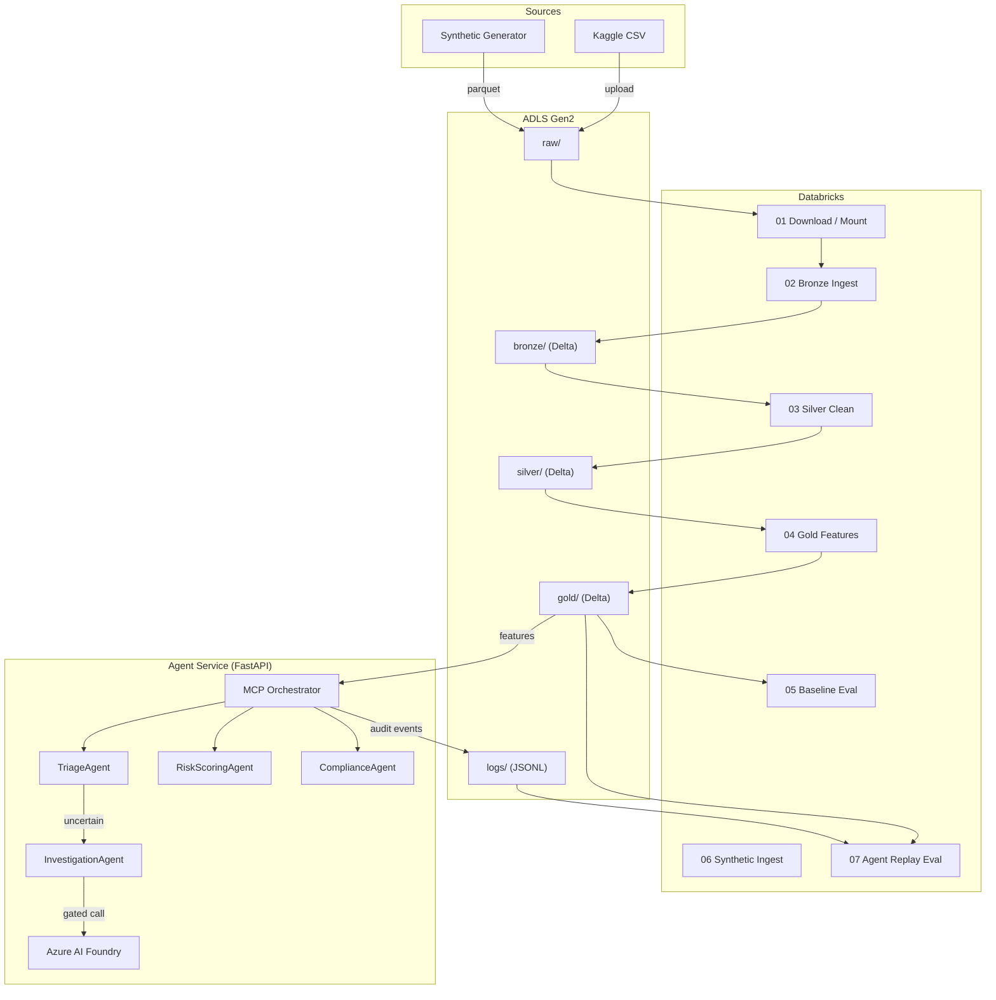
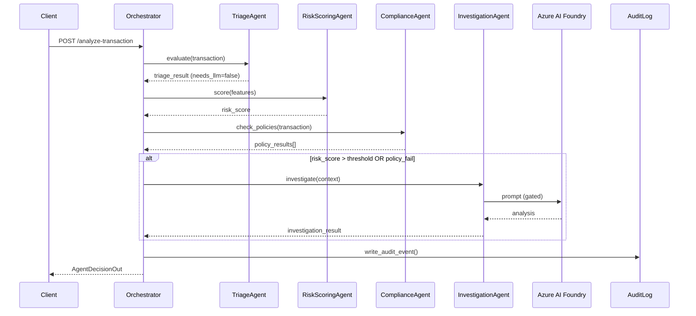

# Architecture — Fraud Detection Platform

## System Context

The platform has three execution domains separated by trust boundaries:

1. **Data Domain (Databricks + ADLS)** — ingestion, transformation, feature engineering, model evaluation.
2. **Agent Domain (FastAPI on App Service)** — real-time transaction analysis via MCP orchestrator.
3. **Infra Domain (Terraform + GitHub Actions)** — provisioning, deployment, secrets management.

---

## Data Flow Diagram



---

## Trust Boundaries

```
┌─────────────────────────────────────────────────────────┐
│  BOUNDARY 1: Azure VNet / Private Endpoints             │
│                                                         │
│  ┌───────────────────┐    ┌──────────────────────────┐  │
│  │  App Service       │    │  ADLS Gen2               │  │
│  │  (Agent container) │◄──►│  raw/ bronze/ gold/ logs/│  │
│  └────────┬──────────┘    └──────────────────────────┘  │
│           │                                             │
│           ▼ MI auth                                     │
│  ┌───────────────────┐                                  │
│  │  Key Vault         │                                  │
│  └───────────────────┘                                  │
│                                                         │
│  BOUNDARY 2: Databricks workspace (own VNet injection)  │
│  ┌───────────────────┐                                  │
│  │  Job Clusters      │◄── ADLS via service principal   │
│  └───────────────────┘                                  │
└─────────────────────────────────────────────────────────┘

BOUNDARY 3: External
  ┌───────────────────┐
  │ Azure AI Foundry   │  ← called only from Agent via HTTPS
  └───────────────────┘
  ┌───────────────────┐
  │ GitHub Actions     │  ← OIDC federated credential
  └───────────────────┘
```

---

## Medallion Architecture

| Layer | Delta Table | Description |
|---|---|---|
| **Bronze** | `bronze.creditcard_transactions` | Raw CSV schema preserved; append-only. |
| **Bronze** | `bronze.synthetic_transactions` | Synthetic generator output. |
| **Silver** | `silver.creditcard_cleaned` | Typed, nulls handled, amount normalised. |
| **Gold** | `gold.cc_features` | Feature vector + label for scoring / eval. |
| **Gold** | `gold.synthetic_features` | Same schema from synthetic data. |
| **Metrics** | `metrics.model_eval` | Baseline model precision / recall / PR-AUC. |
| **Metrics** | `metrics.agent_eval` | Agent decision accuracy vs ground truth. |
| **Results** | `results.agent_decisions` | Raw agent decision records from replay. |

---

## Agent Orchestration Flow



---

## Key Design Decisions

| Decision | Rationale | Tradeoff |
|---|---|---|
| Batch-first (no streaming) | Simpler infra, cheaper; streaming is Phase 2. | Higher latency for real-time use cases. |
| Job clusters only | Cost control; no idle interactive clusters. | Slower notebook iteration during dev. |
| LLM gated by triage | 90%+ of transactions are clear-cut; saves ~$0.01–0.03 per skipped call. | Uncertain-region accuracy depends on threshold tuning. |
| Prompt hash, not raw prompt | Privacy + storage savings. | Cannot replay exact prompts without re-generation. |
| OIDC, no PATs in CI | Zero long-lived secrets in GitHub. | Slightly more setup for federated credential. |
